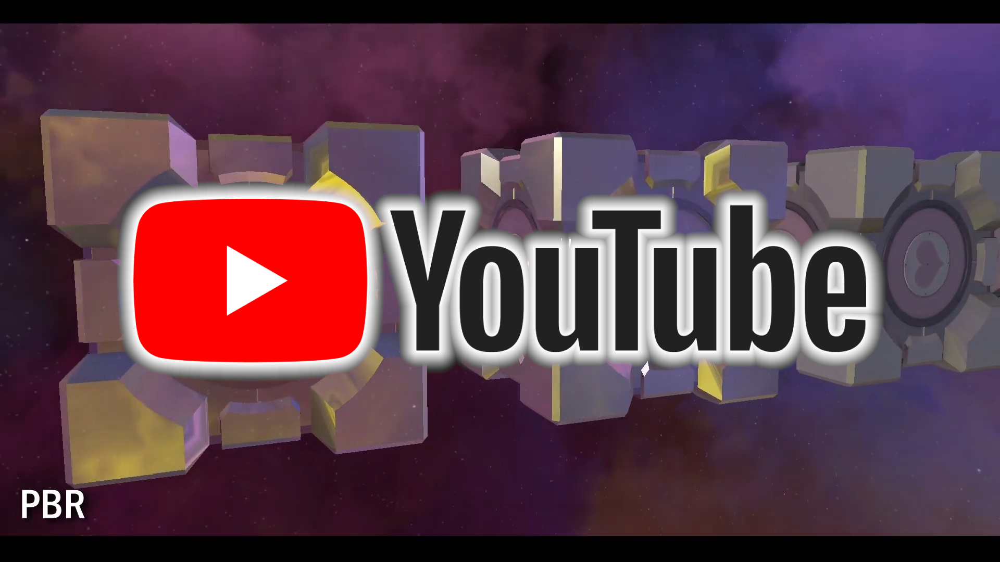
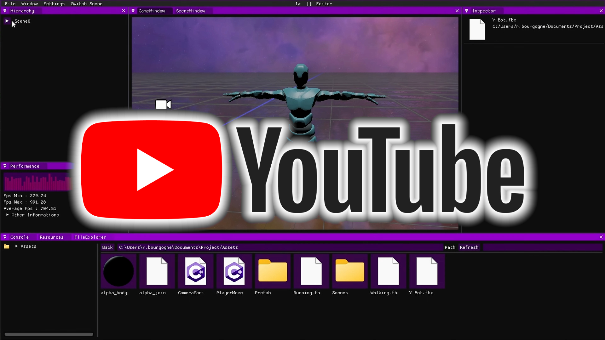

# Pandor Engine

  

## Project Description:

**Pandor Engine** is a **game engine** created in 4 months as our end-of-second-year project at ISART Digital.  
For this project, I collaborated with three other programmers.  
My intentions were mainly focused on **scripting**, **lights**, **PBR**, and **skyboxes**.

## Trailer Video

## Demo Video

<h2 style="color:cyan"> Libraries used </h2>

<ul>
<li>Graphics API : OpenGL
<li>Interface : Dear ImGui
<li>FBX loader : ofbx 
<li>Texture and image loading : STB Image
<li>Desktop : GLFW
<li>Physics : PhysX
<li>Sound : MiniAudio
<li>Scripting : Mono
<li>Others : 
<ul>
<li> - Font Library : Freetype
<li> - TextEditor : ImGuiColorTextEdit
<li> - Hot Reload : FileWatch
</ul>
</ul>

 

Authors : **Bruno GOMES** | **Matias HÉNO** | **Romain BOURGOGNE** | **Umut OSMANOGLU**

For [ISART Digital](https://www.isart.com)
